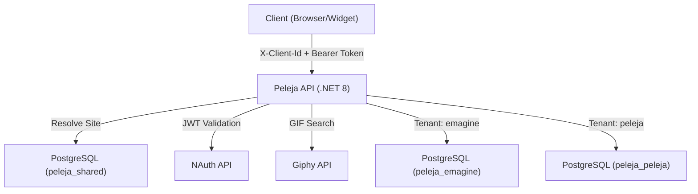

# Peleja - Comments Widget Backend


## Overview

**Peleja** is a multi-tenant comments widget backend API that provides commenting, replies, likes, and GIF integration for any web page. Built with **.NET 8** and **Clean Architecture**, it supports tenant isolation with per-tenant databases and authentication via **NAuth**.

---

## Features

- 💬 **Comments** - Create, edit, delete comments with soft-delete support
- 🔁 **Replies** - Single-level threaded replies on comments
- ❤️ **Likes** - Toggle like/unlike with aggregated counts
- 🎞️ **GIF Search** - Integrated Giphy search for embedding GIFs in comments
- 🌐 **Site Management** - Register sites with unique ClientId, per-site moderation
- 🏢 **Multi-Tenant** - Per-tenant database isolation with dynamic JWT secret resolution
- 🔐 **NAuth Authentication** - JWT-based auth with per-tenant secrets via `ITenantSecretProvider`
- 📄 **Cursor Pagination** - Efficient cursor-based pagination with "recent" and "popular" sorting
- 🛡️ **Rate Limiting** - IP-based rate limiting on POST endpoints
- 📖 **Swagger** - Auto-generated API documentation

---

## Technologies Used

### Core
- **.NET 8.0** - Web API framework
- **Entity Framework Core** - ORM with PostgreSQL provider
- **AutoMapper** - Object mapping between layers

### Database
- **PostgreSQL 17** - Per-tenant database isolation

### Authentication & Security
- **NAuth 0.5.10** - JWT authentication with multi-tenant support
- **AspNetCoreRateLimit** - IP rate limiting

### Testing
- **xUnit** - Unit and integration test framework
- **Moq** - Mocking library
- **FluentAssertions** - Assertion library
- **Flurl.Http** - HTTP client for API integration tests
- **Bruno** - API collection for manual testing

### DevOps
- **Docker** - Containerization
- **GitHub Actions** - CI/CD (versioning, releases, deployment)
- **GitVersion** - Semantic versioning

---

## Project Structure

```
Peleja/
├── Peleja.API/              # REST API layer (Controllers, Middleware)
├── Peleja.Application/      # DI registration, Tenant context/providers
├── Peleja.Domain/           # Domain models (rich entities), Services, Mappings
├── Peleja.DTO/              # Data Transfer Objects
├── Peleja.Infra/            # EF Core DbContext, Repositories, Mappings
├── Peleja.Infra.Interfaces/ # Generic repository interfaces
├── Peleja.Tests/            # Unit tests (Domain + Infra)
├── Peleja.Tests.API/        # Integration tests (HTTP)
├── bruno/                   # Bruno API collection
├── docs/                    # API and architecture documentation
├── .github/workflows/       # CI/CD pipelines
├── docker-compose.yml       # Docker (development)
├── docker-compose-prod.yml  # Docker (production)
├── Dockerfile               # Multi-stage build
├── peleja.sql               # Database schema
└── README.md
```

---

## System Design



The widget sends `X-Client-Id` header. The API resolves the Site from the shared database, determines the tenant, validates JWT tokens via NAuth's `ITenantSecretProvider`, and routes operations to the tenant-specific PostgreSQL database.

> Source: [`docs/system-design.mmd`](docs/system-design.mmd)

---

## Additional Documentation

| Document | Description |
|----------|-------------|
| [API Overview](docs/api/README.md) | API documentation index |
| [Authentication](docs/api/authentication.md) | NAuth authentication flow |
| [Comment Controller](docs/api/comment-controller.md) | Comments endpoint reference |
| [Comment Like Controller](docs/api/comment-like-controller.md) | Likes endpoint reference |
| [Site Controller](docs/api/site-controller.md) | Site management endpoint reference |
| [Giphy Controller](docs/api/giphy-controller.md) | GIF search endpoint reference |

---

## Environment Configuration

### 1. Copy the environment template

```bash
cp .env.example .env
```

### 2. Edit the `.env` file

```bash
# Database
POSTGRES_USER=postgres
POSTGRES_PASSWORD=your_password_here
POSTGRES_DB=peleja
CONNECTION_STRING=Host=db;Port=5432;Database=peleja;Username=postgres;Password=your_password_here
SHARED_CONNECTION_STRING=Host=db;Port=5432;Database=peleja_shared;Username=postgres;Password=your_password_here

# NAuth
NAUTH_API_URL=http://nauth-api:80
JWT_SECRET=your_jwt_secret_key_here_at_least_64_characters_long
BUCKET_NAME=Peleja

# Giphy
GIPHY_API_KEY=your_giphy_api_key_here

# App
APP_PORT=5000
```

> **Important**: Never commit `.env` files with real credentials. Only `.env.example` is version controlled.

### Production

```bash
cp .env.prod.example .env.prod
```

Production uses separate connection strings and JWT secrets per tenant (`EMAGINE_*`, `PELEJA_*`).

---

## Docker Setup

### Prerequisites

```bash
docker network create emagine-network
```

### Development

```bash
docker-compose up -d --build
```

### Production

```bash
docker-compose -f docker-compose-prod.yml up -d --build
```

> Production does not create a PostgreSQL container — it expects an external database.

### Accessing the Application

| Service | URL |
|---------|-----|
| **Peleja API** | http://localhost:5000 |
| **Swagger** | http://localhost:5000/swagger (dev only) |

### Docker Compose Commands

| Action | Command |
|--------|---------|
| Start services | `docker-compose up -d` |
| Start with rebuild | `docker-compose up -d --build` |
| Stop services | `docker-compose stop` |
| View logs | `docker-compose logs -f` |
| Remove containers | `docker-compose down` |
| Remove containers and volumes | `docker-compose down -v` |

---

## Manual Setup (Without Docker)

### Prerequisites
- .NET 8.0 SDK
- PostgreSQL 17

### Steps

#### 1. Create the database

```bash
psql -U postgres -c "CREATE DATABASE peleja;"
psql -U postgres -d peleja -f peleja.sql
```

#### 2. Configure appsettings

Edit `Peleja.API/appsettings.Development.json` with your database credentials and NAuth settings.

#### 3. Run the API

```bash
dotnet run --project Peleja.API
```

---

## Testing

### Unit Tests

```bash
dotnet test --filter "FullyQualifiedName~Peleja.Tests."
```

### API Integration Tests

Requires the API and NAuth to be running. Configure `Peleja.Tests.API/appsettings.Testing.json` (copy from `appsettings.Testing.Example.json`).

```bash
dotnet test --filter "FullyQualifiedName~Peleja.Tests.API"
```

### Test Structure

```
Peleja.Tests/
├── Domain/Services/         # CommentService, CommentLikeService, GiphyService tests
└── Infra/
    ├── Context/             # TestDbContextFactory
    └── Repositories/        # CommentRepository, CommentLikeRepository tests

Peleja.Tests.API/
├── Config/                  # AuthFixture, auth configuration
└── Controllers/             # HTTP integration tests
```

### Bruno API Collection

Open the `bruno/` directory in [Bruno](https://www.usebruno.com/) for manual API testing with pre-configured environments (local, docker, production).

---

## API Endpoints

### Site Management (requires `X-Tenant-Id` header)

| Method | Endpoint | Description | Auth |
|--------|----------|-------------|------|
| POST | `/api/v1/sites` | Register a new site | Yes |
| GET | `/api/v1/sites` | List my sites | Yes |
| PUT | `/api/v1/sites/{id}` | Update site (owner only) | Yes |

### Comments & Likes (requires `X-Client-Id` header)

| Method | Endpoint | Description | Auth |
|--------|----------|-------------|------|
| GET | `/api/v1/comments?pageUrl=` | List comments with pagination | No |
| POST | `/api/v1/comments` | Create comment or reply | Yes |
| PUT | `/api/v1/comments/{id}` | Update comment (author only) | Yes |
| DELETE | `/api/v1/comments/{id}` | Delete comment (author, admin, or site owner) | Yes |
| POST | `/api/v1/comments/{id}/like` | Toggle like | Yes |
| GET | `/api/v1/giphy/search?q=` | Search GIFs | Yes |

---

## CI/CD

### GitHub Actions

| Workflow | Trigger | Description |
|----------|---------|-------------|
| **version-tag** | Push to main | Auto-generates semantic version tags via GitVersion |
| **create-release** | After version-tag | Creates GitHub releases for major/minor versions |
| **deploy-prod** | Manual dispatch | SSH deploy to production with Docker Compose |

---

## Backup and Restore

### Backup

```bash
pg_dump -U postgres peleja_shared > backup_shared.sql
pg_dump -U postgres peleja_emagine > backup_emagine.sql
pg_dump -U postgres peleja_peleja > backup_peleja.sql
```

### Restore

```bash
psql -U postgres peleja_shared < backup_shared.sql
psql -U postgres peleja_emagine < backup_emagine.sql
psql -U postgres peleja_peleja < backup_peleja.sql
```

---

## Troubleshooting

### NAuth: JwtSecret not configured

Ensure `Tenants:{tenantId}:JwtSecret` is set in appsettings or environment variables. The `ITenantSecretProvider` resolves the secret per tenant from configuration.

### PostgreSQL timestamp error

The project uses `timestamp without time zone`. Domain models use `DateTime.Now` (not `DateTime.UtcNow`) to avoid Npgsql `Kind=UTC` errors.

### Docker: emagine-network not found

```bash
docker network create emagine-network
```

---

## Author

Developed by **[Emagine](https://github.com/emaginebr)**

---

## License

This project is licensed under the **MIT License** - see the [LICENSE](LICENSE) file for details.

---

## Support

- **Issues**: [GitHub Issues](https://github.com/emaginebr/Peleja/issues)

---

**If you find this project useful, please consider giving it a star!**
